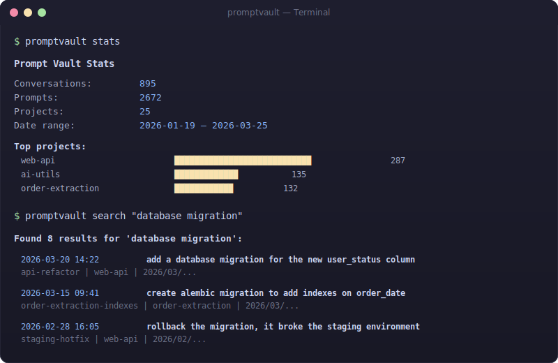
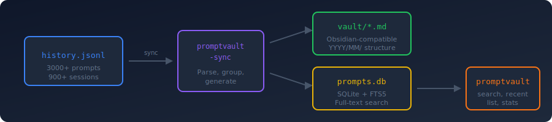

<p align="center">
  
</p>

<p align="center">
  <a href="https://github.com/reidemeister94/promptvault/releases"></a>
  <a href="LICENSE"></a>
  <a href="https://github.com/reidemeister94/promptvault/stargazers"></a>
  <a href="https://github.com/reidemeister94/promptvault/issues"></a>
  
  
</p>

<p align="center">
  <b>Your Claude Code conversations, searchable forever.</b>
</p>

<p align="center">
  <a href="#the-problem">Problem</a> &middot;
  <a href="#how-it-works">How It Works</a> &middot;
  <a href="#quick-start">Quick Start</a> &middot;
  <a href="#commands">Commands</a> &middot;
  <a href="#real-time-capture">Real-Time Capture</a> &middot;
  <a href="#architecture">Architecture</a>
</p>

---

Every prompt you send to Claude Code is valuable. A debugging approach that worked. A refactoring strategy you'll want to reuse. A question you phrased perfectly. But right now, those prompts are buried in raw JSONL files that Claude Code may compact or delete at any time.

**promptvault** turns your Claude Code conversation history into a searchable markdown library + SQLite database. Browse conversations in Obsidian like a second brain, or search them instantly from the terminal.

Zero external dependencies. Pure Python stdlib. One command to sync.

<p align="center">
  
</p>

---

## The Problem

Claude Code stores your conversation history in `~/.claude/history.jsonl` — a raw, append-only JSONL file. It works, but:

- **Not searchable.** Want to find that prompt about database migrations? `grep` through 3000 lines of JSON.
- **Not browsable.** No conversation grouping, no timestamps, no context.
- **Not persistent.** Claude Code compacts and deletes old session files. Your history can shrink without warning.
- **Not shareable.** Raw JSONL isn't something you can open in Obsidian or publish on GitHub.

You've sent thousands of prompts. Each one represents a decision, a technique, a solution. **promptvault makes sure you never lose them.**

---

## How It Works

<p align="center">
  
</p>

**One command. Two outputs.**

`promptvault-sync` reads your Claude Code history, groups prompts by conversation, and generates:

1. **Markdown vault** — One `.md` file per conversation, organized by `YYYY/MM/`, with YAML frontmatter. Drop the vault folder into Obsidian and browse your entire prompt history like a second brain.

2. **SQLite database** — Full-text search index powered by FTS5 with BM25 ranking. Search 3000+ prompts in milliseconds from your terminal.

The sync is **idempotent** — run it as many times as you want. It always rebuilds from the authoritative source (`history.jsonl`), so it's impossible to get into a bad state.

---

## Quick Start

### Install

```bash
# Clone and install
git clone https://github.com/reidemeister94/promptvault.git
cd promptvault
pip install -e .
```

### Sync your history

```bash
promptvault-sync
```

```
Reading history from /Users/you/.claude/history.jsonl...
Found 895 conversations, 3009 prompts
Generating markdown vault...
Building SQLite database...

Done! Vault: ~/.claude/prompt-library/vault
Database: ~/.claude/prompt-library/prompts.db
```

### Search

```bash
promptvault search "database migration"
```

That's it. Three commands. Your entire Claude Code history is now searchable.

---

## Commands

### `promptvault search "query"`

Full-text search across all your prompts. Uses SQLite FTS5 with BM25 ranking — the same algorithm behind search engines.

```bash
promptvault search "shipping scheduler"
promptvault search "pytest fixtures" -n 5
```

### `promptvault recent [N]`

Show your most recent prompts. Defaults to 10.

```bash
promptvault recent       # last 10
promptvault recent 20    # last 20
```

### `promptvault list`

List conversations. Filter by date or project.

```bash
promptvault list                          # all conversations
promptvault list --date 2026-03-25        # today's conversations
promptvault list --project shipping       # filter by project name
promptvault list --date 2026-03-25 -n 5   # today's top 5
```

### `promptvault stats`

Overview of your vault — conversation count, prompt count, top projects, date range.

```bash
promptvault stats
```

### `promptvault-sync`

Rebuild the entire vault and database from `~/.claude/history.jsonl`. Idempotent — safe to run anytime.

```bash
promptvault-sync
```

---

## Markdown Vault

Each conversation becomes a clean, Obsidian-compatible markdown file:

```markdown
---
session_id: c792e74f-c1bf-4bd1-af69-795b50f355b4
project: /Users/you/my-project
started: 2026-03-25T18:51:48
ended: 2026-03-25T19:20:05
prompt_count: 10
tags:
  - claude-code
  - promptvault
---

# Refactor the shipping scheduler API endpoint

**Project:** `my-project`
**Duration:** 2026-03-25 18:51 - 19:20 (28 min)
**Prompts:** 10

---

## Prompt 1 — 18:51:48

refactor the shipping scheduler API to use the new service layer...

## Prompt 2 — 18:55:12

can you add proper error handling for the database connection?
```

### Vault Structure

```
~/.claude/prompt-library/vault/
├── _index.md                    # Global index with links to all conversations
├── 2026/
│   ├── 01/
│   │   ├── 2026-01-19__b300fdf4__first-prompt-slug.md
│   │   └── ...
│   ├── 02/
│   │   └── ...
│   └── 03/
│       ├── 2026-03-25__c792e74f__refactor-shipping-scheduler.md
│       └── ...
```

Open `~/.claude/prompt-library/vault/` as an Obsidian vault. Use the Calendar plugin for chronological browsing. Use tags and links for cross-referencing.

---

## Real-Time Capture

promptvault includes a Claude Code hook that captures every prompt the moment you send it — no sync needed.

### Setup

The hook is automatically registered when you install promptvault. It adds a `UserPromptSubmit` entry to `~/.claude/hooks.json`:

```json
{
  "hooks": {
    "UserPromptSubmit": [{
      "hooks": [{
        "type": "command",
        "command": "python3 /path/to/promptvault/promptvault/hook.py",
        "timeout": 5000
      }]
    }]
  }
}
```

The hook is:
- **Fast** — <50ms, pure JSON append
- **Silent** — no stdout, doesn't inject into Claude's context
- **Safe** — errors are swallowed, never blocks Claude Code

Captured prompts go to `~/.claude/prompt-library/capture.jsonl` — a real-time log you can query between syncs.

---

## Architecture

```
promptvault/
├── promptvault/
│   ├── sync.py       # Reads history.jsonl → generates vault/ + prompts.db
│   ├── search.py     # CLI search over SQLite FTS5
│   └── hook.py       # UserPromptSubmit hook (real-time capture)
├── tests/
│   ├── test_sync.py
│   ├── test_search.py
│   └── test_hook.py
├── pyproject.toml
└── README.md
```

### Design Decisions

| Decision | Why |
|----------|-----|
| **`history.jsonl` as source of truth** | It's authoritative, always complete, and maintained by Claude Code itself. Session JSONL files are too complex for prompt-only extraction. |
| **Full rebuild on every sync** | Simpler than incremental — no state bugs, no dedup logic. Fast enough at any realistic scale (~1 second for 3000 prompts). |
| **Date-based directory structure** | Flat directories are unusable at 900+ files. Project-based grouping breaks when prompts span projects. Date-based maps naturally to Obsidian's Calendar plugin. |
| **SQLite FTS5 for search** | Built into Python stdlib. BM25 ranking out of the box. No external search engine needed. |
| **Zero external dependencies** | Install with `pip install -e .` and nothing else. Python stdlib has everything: `json`, `sqlite3`, `pathlib`, `argparse`. |
| **Hook as convenience, not requirement** | The sync script is the authoritative data path. The hook is a bonus for real-time access. If the hook fails, nothing is lost. |

### Environment Variables

| Variable | Default | Description |
|----------|---------|-------------|
| `PROMPTVAULT_HISTORY` | `~/.claude/history.jsonl` | Path to Claude Code history file |
| `PROMPTVAULT_OUTPUT` | `~/.claude/prompt-library` | Output directory for vault + DB |
| `PROMPTVAULT_DB` | `~/.claude/prompt-library/prompts.db` | Path to SQLite database |
| `PROMPTVAULT_CAPTURE_LOG` | `~/.claude/prompt-library/capture.jsonl` | Real-time capture log path |

---

## Development

```bash
git clone https://github.com/reidemeister94/promptvault.git
cd promptvault
pip install -e .
make setup-dev-env   # Install pre-commit hooks

make test            # Run tests
make lint            # Lint with ruff
make format          # Format with ruff
```

### Tests

32 tests covering sync, search, and hook functionality. All tests use synthetic data — no dependency on real `history.jsonl`.

```bash
pytest -v
```

---

## Roadmap

- [ ] **Incremental sync** — Only process new prompts since last sync
- [ ] **Claude response capture** — Optionally include Claude's responses (from session JSONL files)
- [ ] **Obsidian plugin** — Native sidebar, auto-sync, graph view integration
- [ ] **TUI browser** — Interactive terminal UI with `textual` for browsing conversations
- [ ] **Export formats** — HTML, PDF, JSON export for sharing
- [ ] **Multi-tool support** — Parse history from Cursor, Copilot, Windsurf, etc.

---

## Contributing

Contributions welcome. Please open an issue to discuss before submitting a PR.

**Ideas:**
- New search features (fuzzy search, date ranges, regex)
- Better conversation naming heuristics
- Support for additional AI coding tools
- Performance optimizations for very large histories

---

## License

MIT

---

<p align="center">
  <b>Stop losing your prompts. Start building your prompt library.</b><br/>
  <sub>If this tool is useful, a star helps others find it.</sub>
</p>

<p align="center">
  <a href="https://github.com/reidemeister94/promptvault/stargazers"></a>
</p>

<p align="center">
  <a href="https://github.com/reidemeister94/promptvault/issues">Report an issue</a> &middot; <a href="#contributing">Contribute</a>
</p>
